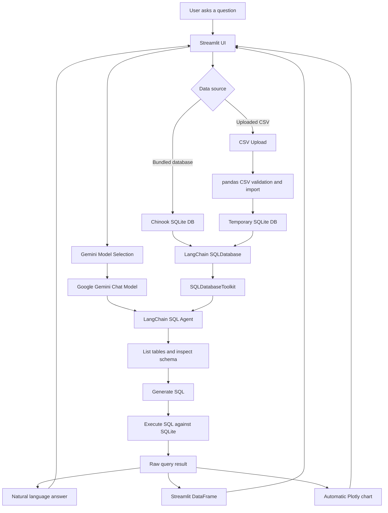

# AI Data Analytics Assistant

An AI-powered SQL analytics assistant that converts natural language questions into SQL, executes them on SQLite databases or uploaded CSV datasets, and returns interactive tables, automatic visualizations, and concise business-style summaries using Google Gemini, LangChain, and Streamlit.

This project is designed as a practical full-stack AI/ML portfolio application: it combines LLM tool-calling, SQL generation, local database execution, CSV ingestion, Streamlit UI engineering, and chart automation in a clean Python architecture.

## Features

- Natural language to SQL query generation
- Google Gemini integration through `langchain-google-genai`
- LangChain SQL Agent with SQLDatabaseToolkit tools
- Built-in Chinook SQLite database support
- CSV upload support with automatic SQLite conversion
- SQLite query execution through SQLAlchemy/LangChain
- SQL schema inspection and query retry behavior through the agent prompt
- Interactive result tables in Streamlit
- Automatic chart generation with Plotly
- Query history for recent analytics questions
- Dynamic Gemini model selection from models available to the API key
- Fallback model list when model discovery is unavailable
- Dark modern Streamlit UI with custom CSS
- Execution metrics including rows, columns, and elapsed time
- Friendly error handling for API keys, quota, network, CSV, and SQL issues
- Optional CLI entry point for terminal-based querying
- Lightweight operational logging to `text2sql-agent.log`

## Screenshots

Screenshots are intentionally organized under `docs/images/` so the repository can present a polished GitHub landing page once images are captured.

Suggested screenshot files:

- `docs/images/dashboard.png` - Main Streamlit analytics workspace
- `docs/images/csv-upload.png` - CSV upload and dataset preview
- `docs/images/sql-generation.png` - Generated SQL expander
- `docs/images/results-table.png` - Query result table
- `docs/images/automatic-chart.png` - Plotly visualization output
- `docs/images/model-selection.png` - Dynamic Gemini model selector

## Architecture



## Project Structure

```text
text-to-sql-agent/
|-- app/
|   |-- __init__.py
|   |-- config.py
|   |-- database.py
|   |-- llm.py
|   |-- main.py
|   |-- prompts.py
|   |-- sql_agent.py
|   `-- utils.py
|-- frontend/
|   |-- styles.css
|   `-- uploads/
|-- docs/
|   |-- GITHUB_PRESENTATION.md
|   `-- images/
|-- assets/
|-- examples/
|   `-- README.md
|-- agent.py
|-- streamlit_app.py
|-- sample_sales.csv
|-- pyproject.toml
|-- uv.lock
|-- tutorial.ipynb
`-- README.md
```

### Core Modules

| Path | Purpose |
| --- | --- |
| `streamlit_app.py` | Main Streamlit frontend. Handles upload UI, model selection, query form, result rendering, charts, metrics, and query history. |
| `agent.py` | Compatibility wrapper for the CLI entry point. |
| `app/main.py` | Command-line interface using Rich panels for questions, progress, answers, and friendly errors. |
| `app/config.py` | Project constants, `.env` loading, model name lookup, API key lookup, database path, and file logging setup. |
| `app/database.py` | SQLite database connection helpers and CSV-to-SQLite import pipeline. |
| `app/llm.py` | Google Gemini chat model initialization for LangChain. |
| `app/prompts.py` | System prompt that instructs the SQL agent how to inspect schema, generate SQL, avoid destructive SQL, and retry failed queries. |
| `app/sql_agent.py` | LangChain SQL agent assembly using Gemini, SQLDatabase, and SQLDatabaseToolkit tools. |
| `app/utils.py` | Helpers for extracting final answers and generated SQL from LangChain/LangGraph agent responses. |
| `frontend/styles.css` | Custom dark UI theme for the Streamlit application. |
| `sample_sales.csv` | Small example CSV dataset for quick local testing. |
| `test_*.py` | Local verification scripts for Gemini, LangChain, toolkit, Chinook, CSV, and full agent execution. |

## Execution Flow

1. The user opens the Streamlit app.
2. The app loads environment variables from `.env`.
3. The sidebar checks API key availability and fetches compatible Gemini text-generation models.
4. The user selects a Gemini model from a dropdown instead of typing a model alias manually.
5. The user chooses a data source:
   - Use the bundled `chinook.db` SQLite database.
   - Upload a CSV file.
6. If a CSV is uploaded, the app validates it with pandas.
7. CSV column names are normalized for SQLite compatibility.
8. The CSV is imported into a temporary SQLite database table named `uploaded_data`.
9. The user enters a natural language question.
10. `create_sql_agent()` builds a LangChain agent with:
    - Gemini chat model
    - LangChain `SQLDatabase`
    - `SQLDatabaseToolkit` tools
    - the SQL system prompt
11. The agent inspects available tables.
12. The agent inspects relevant table schemas.
13. Gemini generates a SQL query through the LangChain tool-calling workflow.
14. The SQL query is executed against SQLite.
15. The final natural language answer is extracted.
16. The generated SQL is optionally displayed.
17. The SQL result is loaded into a pandas DataFrame for display.
18. Streamlit renders metrics, the result table, and an automatic chart when possible.
19. The query and response are added to the session query history.

## Tech Stack

### Language

- Python 3.11+

### Frontend

- Streamlit
- Custom CSS

### AI and Agent Framework

- Google Gemini
- Google GenAI SDK
- LangChain
- LangGraph
- `langchain-google-genai`
- `langchain-community`

### Database and Data Processing

- SQLite
- SQLAlchemy
- pandas

### Visualization

- Plotly Express
- Streamlit DataFrame

### CLI and Developer Tools

- Rich
- python-dotenv
- uv lockfile support
- Local verification scripts

## Installation

### 1. Clone the repository

```bash
git clone https://github.com/karan-sharma22/AI-assistant-for-SQL.git
cd AI-assistant-for-SQL
```

### 2. Create and activate a virtual environment

Windows PowerShell:

```powershell
python -m venv .venv
.\.venv\Scripts\Activate.ps1
```

macOS/Linux:

```bash
python -m venv .venv
source .venv/bin/activate
```

### 3. Install dependencies

```bash
pip install -e .
```

Or with `uv`:

```bash
uv venv --python 3.11
uv pip install -e .
```

### 4. Configure environment variables

Create a `.env` file in the project root:

```env
GOOGLE_API_KEY=your_google_api_key_here
```

### 5. Run the Streamlit app

```bash
streamlit run streamlit_app.py
```

If `streamlit` is not recognized:

```bash
python -m streamlit run streamlit_app.py
```

### 6. Optional CLI usage

```bash
python agent.py "List all tables"
python agent.py --csv sample_sales.csv "Top 5 customers by revenue"
python agent.py --show-sql "How many customers are from Canada?"
```

## Environment Variables

| Variable | Required | Description |
| --- | --- | --- |
| `GOOGLE_API_KEY` | Yes | Google AI Studio / Gemini API key used by the Gemini chat model and model discovery. |
| `LLM_MODEL_NAME` | No | Optional default Gemini model name. In the Streamlit app, users can select a compatible model from the sidebar. |
| `LANGCHAIN_TRACING_V2` | No | Enables LangSmith tracing when configured. |
| `LANGSMITH_ENDPOINT` | No | LangSmith API endpoint. |
| `LANGCHAIN_API_KEY` | No | LangSmith API key for tracing. |
| `LANGCHAIN_PROJECT` | No | LangSmith project name. |

## Example Questions

### Chinook Database Examples

1. List all tables in the database.
2. Show the first 5 albums.
3. How many customers are from Canada?
4. Which countries have the most customers?
5. Who are the top 5 customers by total invoice amount?
6. Which employee supports the most customers?
7. What are the top 10 most purchased tracks?
8. Which artists have the most albums?
9. What is the total revenue by country?
10. Which music genre generated the most revenue?
11. What are the monthly sales trends?
12. Which customers have not made a purchase recently?

### CSV Dataset Examples

1. How many rows are in this dataset?
2. Show the first 10 rows.
3. What are the column names?
4. Top 5 customers by revenue.
5. What is the average revenue?
6. Revenue by region.
7. Which region has the highest sales?
8. Which customer has the lowest revenue?
9. Show monthly revenue trends.
10. Summarize this dataset in simple business terms.

## Supported Data Sources

### Built-in Chinook SQLite Database

The app is configured to use `chinook.db` as the default SQLite database. Chinook is a common sample database for music-store analytics and is useful for demonstrating joins, aggregation, filtering, and schema-aware SQL generation.

### Uploaded CSV Files

Users can upload CSV files from the Streamlit sidebar. The app:

- Saves the uploaded file under `frontend/uploads/`.
- Validates that it is a readable CSV.
- Rejects empty or malformed files.
- Normalizes column names for SQLite.
- Converts the CSV into a temporary SQLite database.
- Exposes the data as a table named `uploaded_data`.

### SQLite

SQLite is used as the execution engine for both bundled databases and uploaded CSVs. This keeps the project local, lightweight, and easy to run without external database infrastructure.

## SQL Generation Pipeline

The SQL generation flow is built around LangChain's SQL agent pattern:

1. `app/sql_agent.py` creates a LangChain agent.
2. `app/database.py` provides a `SQLDatabase` object.
3. `SQLDatabaseToolkit` exposes database tools to the agent.
4. `app/llm.py` initializes Gemini as the reasoning and query-generation model.
5. `app/prompts.py` instructs the agent to inspect tables first, inspect schema, generate syntactically correct SQL, avoid destructive statements, and retry if execution fails.
6. The generated SQL is executed through toolkit/database tools.
7. The final answer and generated SQL are extracted from the agent response.

The prompt explicitly prevents destructive DML operations such as `INSERT`, `UPDATE`, `DELETE`, and `DROP`.

## Visualization Workflow

The Streamlit app converts SQL results into a pandas DataFrame, then chooses a Plotly chart based on the shape of the data:

- One categorical column and one numeric column:
  - Pie chart for small category counts
  - Bar chart for larger category counts
- Two or more numeric columns:
  - Scatter plot
- One numeric column:
  - Histogram
- Date-like index with numeric values:
  - Line chart

This gives users immediate visual feedback without requiring manual chart configuration.

## Error Handling

The app includes friendly handling for common failure modes:

- Missing `GOOGLE_API_KEY`
- Invalid Google API key
- Gemini quota or rate-limit errors
- Temporarily unavailable Gemini service
- Unavailable or unsupported model names
- Network/proxy errors
- Missing CSV files
- Empty CSV files
- Malformed CSV files
- Unsupported upload formats
- SQL syntax or execution errors

Detailed runtime information is written to `text2sql-agent.log`.

## Performance and Caching

The Streamlit app uses caching to avoid repeated expensive setup work:

- Model discovery is cached for one hour with `st.cache_data`.
- SQL agent creation is cached with `st.cache_resource`.
- Database connections are cached with `st.cache_resource`.
- CSV preview loading is cached with `st.cache_data`.
- Query history is held in Streamlit session state.

Gemini is initialized with deterministic settings for stable SQL generation.

## Dynamic Model Selection

The sidebar fetches Gemini models available to the configured API key and filters them to compatible text-generation models. This avoids relying on aliases such as `gemini-flash-latest`, which can change over time and may unexpectedly route to a heavier or more quota-limited model.

Preferred lightweight Flash models are shown first, and the app falls back to a small known-compatible list if model discovery fails.

## Development and Verification

Local verification scripts are included:

```bash
python test_langchain.py
python test_toolkit.py
python test_chinook.py
python test_csv.py
python test_agent.py
```

These scripts help isolate whether issues are coming from Gemini, LangChain, toolkit setup, SQLite, CSV import, or the Streamlit frontend.

## Future Improvements

- Add automated unit tests for CSV validation and response parsing.
- Add integration tests for Streamlit query flows.
- Persist uploaded CSV SQLite databases across sessions.
- Support multiple uploaded CSV files and joins.
- Add schema preview and table browser panels.
- Add SQL download/export support.
- Add chart type controls for advanced users.
- Add Docker support for reproducible deployment.
- Add GitHub Actions for linting and test execution.
- Add authentication for hosted deployments.
- Add saved dashboards and reusable query templates.

## GitHub Presentation

Suggested repository metadata is available in [docs/GITHUB_PRESENTATION.md](docs/GITHUB_PRESENTATION.md).

## License

MIT License. See `LICENSE` when added.

## Author

Karan Sharma

- GitHub: [karan-sharma22](https://github.com/karan-sharma22)
# AI-assistant-for-SQL

